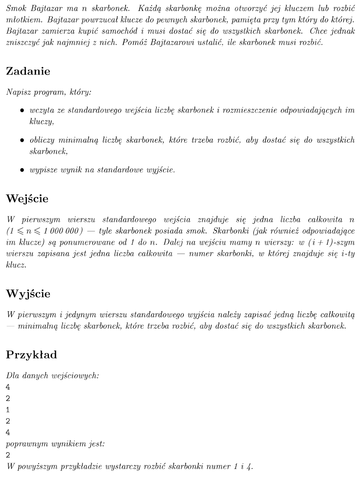

# Algorytmy i Struktury Danych - Kamil Butryn

## Opis
Repozytorium zawiera zadania z labolatoriów. Programy były pisane z zadaną przez prowadzącego specyfikacją.

## Z1 - Set
* union -- suma dwóch zbiorów
* intersection -- przecięcie dwóch zbioróœ
* difference -- różnica 
* insert -- wstawianie do zbioru
* isMember - sprawdzanie czy element jest w zbiorze
* pop -- pobieranie i usuwanie ze zbioru
* set1.popAll(set2) - usuwa wszystkie elementy ze zbioru set1, które są w zbiorze set2 (nie robi nic, jeśli elem. w set2 nie występuje w set1), za pomocą funkcji Pop

## Z2 - ADT PriorityQueue
Zaimplementowane przy użyciu kopca min-max. Metody:
* void InsertElement(element e) -- Wstawia element do kolejki
* int getMaxPriority() -- pobiera wartość najwyższego priorytetu
* Element Pop() -- Pobiera i usuwa z kolejki element o najwyższym priorytecie
* IncreasePriority(element e , int priority) -- zwiększa priorytet elementu. W przypadku istnienia wielu jednakowych elementów, zwiększa priorytet wszystkim

## Z3 - Grafy: Macierz i lista powiązana
Konwersja grafu z formatu .csv do .dot.

## Z4 - Grafy: BFS
Przeszukiwanie grafu w stylu BFS i wypisywanie kolejnych wierzchołków.

## Z4 - Grafy: DFS
Przeszukiwanie grafu w stylu DFS i wypisywanie kolejnych wierzchołków.

## Z5 - Grafy: Badanie spójności grafu
Użycie jednej z formy przeszukiwan i sprawdzanie ilości spójnych składowych.

## Z6 - Grafy: Algorytm Bellmana-Forda
Wyszukiwanie najkrótszej ścieżki.

## Z7 - Grafy: Algorytm Dijkstry
Wyszukiwanie najkrótszej ścieżki.

## Z8 - Grafy: Algorytm Floyda-Warshalla
Wyszukiwanie najkrótszej ścieżki między wszystkimi wierzchołkami.

## Z9 - Grafy: Algorytm Kruskala
Algorytm najmniejszego drzewa rozpinającego.

## Z10 - Grafy: Algorytm Kruskala
Algorytm najmniejszego drzewa rozpinającego.

## Projekt: Skarbonki

